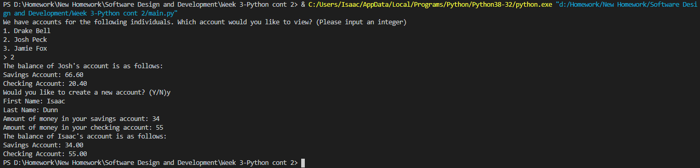

# Overview

This is a simple banking program designed to display a proficiency with classes and object-oriented programming. It creates a list of 3 accounts and allows the user to display one. It then allows the user to create one and displays it back to them.

# Development Environment

* Python 3.8.5
* Visual Studio Code

# Execution

To run: `python main.py`   
<b>A working example:</b>

# Useful Websites

1. [Python Reference](https://docs.python.org/3/genindex-I.html)
2. [Stack Overflow Python Questions](https://stackoverflow.com/questions/tagged/python)
3. [W3Schools Python Tutorial](https://www.w3schools.com/python/)